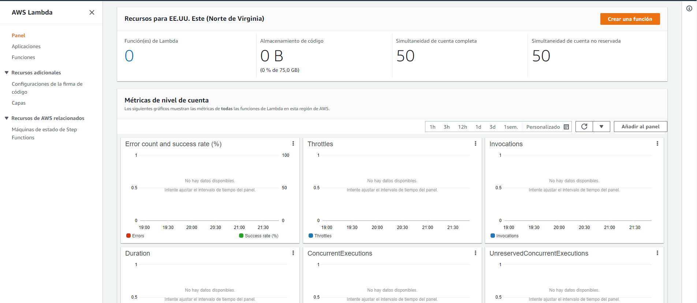
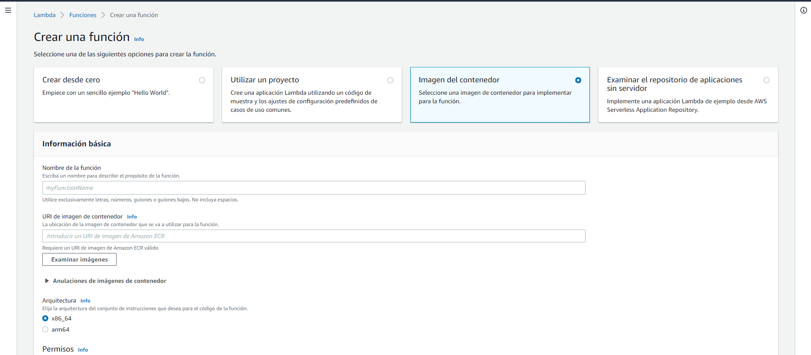
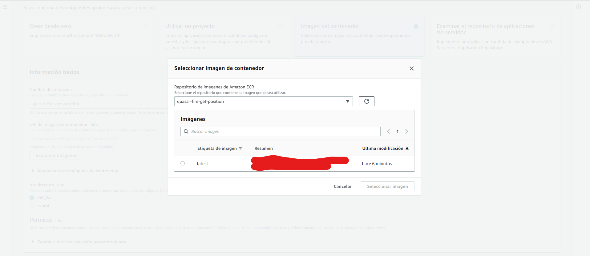
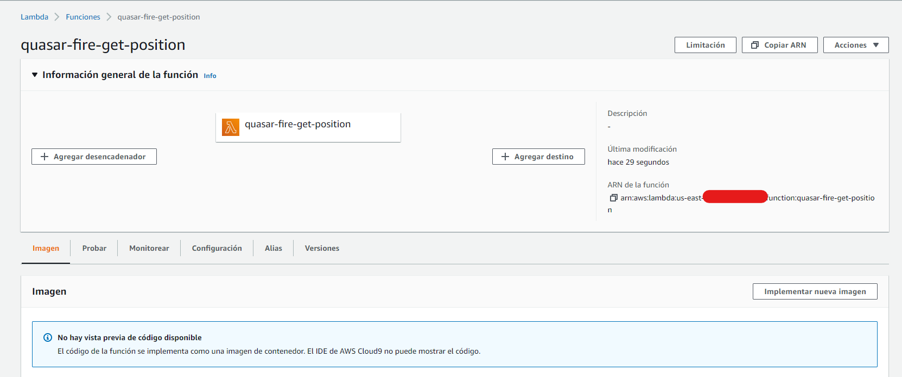
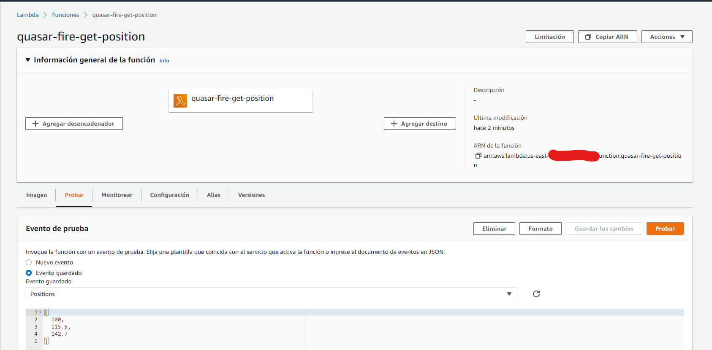
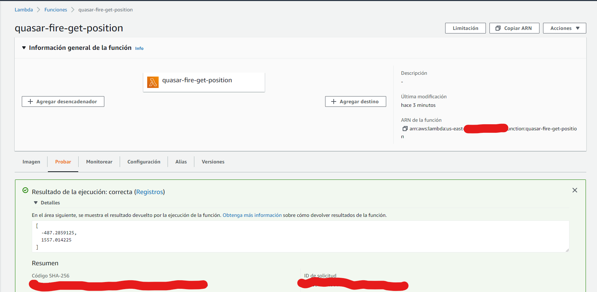

# Trilateración #

Este algoritmo devuelve las coordenadas de un punto P en el espacio, a través de las coordenadas de los puntos C1, C2 y C3 y sus respectivas distancias del punto P.
Este algoritmo se ejecutará a través de una lambda en AWS.

### Cálculo de la trilateración ###

Hay varios algoritmos que resuelven el problema de multilateración de rango verdadero cartesiano 3-D directamente (es decir, en forma cerrada), por ejemplo, Fang. Además, se pueden adoptar algoritmos de forma cerrada desarrollados para multilateración de pseudo rango . El algoritmo de Bancroft (adaptado) emplea vectores, lo que es una ventaja en algunas situaciones.

<div style="text-align:center">
    
</div>


Fig. 1 Escenario de multilateración de rango verdadero en 3D. C1, C2 y C3 son centros conocidos de esferas en el plano x,y. P es el punto cuyas coordenadas (x,y,z) se desean en función de sus rangos a C1, C2 y C3.

El algoritmo más simple corresponde a los centros de esfera en la Fig. 1. La figura 'página' es el plano que contiene C1 , C2 y C3 . Si P es un 'punto de interés' (por ejemplo, un vehículo) en{\ estilo de visualización (x, y, z)}(x, y, z), entonces el teorema de Pitágoras produce los rangos de inclinación entre P y los centros de las esferas:

<div style="text-align:center">
    
</div>

Así, las coordenadas de P son:

<div style="text-align:center">
    
</div>

[Three Cartesian dimensions, three measured slant ranges](https://en.wikipedia.org/wiki/True-range_multilateration#Three_Cartesian_dimensions,_three_measured_slant_ranges)

### Dockerfile ###

Instala las librerías necesarias para el funcionamiento del modelo y construye la imagen para ser desplegada como una lambda en AWS.

### Proceso de despliegue ###

1. Crear la imagen de docker: 
```
docker build -t quasar-fire-get-position .
```
2. Login a AWS a través de la consola de comandos, la url hace referencia al repositorio de imagenes en AWS (ECR):
```
aws ecr get-login-password --region us-east-1 | docker login --username AWS --password-stdin accountNumber.dkr.ecr.us-east-1.amazonaws.com
```
3. Asigna tag a la imagen ya creada:
```
docker tag npl-model:latest accountNumber.dkr.ecr.us-east-1.amazonaws.com/quasar-fire-get-position:latest
```
4. Hacer push de la imagen a ECR:
```
docker push accountNumber.dkr.ecr.us-east-1.amazonaws.com/quasar-fire-get-position:latest
```

Con estos pasos la imagen ya se encuentra en ECR de AWS y está listo para la creación y ejecución de lambdas.

### Crear lambda con imagen ya cargada ###
1. Ingresamos a AWS Lambda a través de la consola web

2. Damos clic en crear función

3. Diligenciar la información requerida así:
    * Seleccionar la opción "Imagen del contenedor"
    * Nombre de la función
    * URI de imagen de contenedor. Clic en "Examinar imágenes" y buscar la imagen quasar-fire-get-position
   
    * Seleccionar la imagen con etiqueta latest y clic en "Seleccionar imagen"
    * Arquitectura: x86_64
    * Creación de un nuevo rol con permisos básicos de Lambda
    * Clic en "Crear una función".

Con esto se realiza la creación de la lambda utilizando la imagen ya cargada.

### ¿Como probar? ###
Después de que la lambda se encuentre con la imagen desplegada.
1. Clic en probar

2. Ingresar JSON de entrada

```
[distancia1, distancia2, distancia3] float32
```
3. Clic en "Probar"
4. En la caja "Resultado de la ejecución" se puede ver la respuesta del modelo


### ¿Como ejecutar lambda desde Java ###
Se requiere la librería de aws-java-sdk

```
Maven:
   <dependency>
      <groupId>com.amazonaws</groupId>
      <artifactId>aws-java-sdk</artifactId>
      <version>1.11.358</version>
   </dependency>
   
Gradle:
   implementation group: 'com.amazonaws', name: 'aws-java-sdk', version: '1.11.358'
```

Código Java:
```
try {
   InvokeRequest invokeRequest = new InvokeRequest()
       .withFunctionName(functionName) //Nombre de la función lambda
       .withPayload(request); //Request en formato String
   InvokeResult invokeResult = null;
   invokeResult = awsLambda.invoke(invokeRequest);
   String response = new String(invokeResult.getPayload().array(), StandardCharsets.UTF_8);
   logger.info("RESPONSE LAMBDA: " + response);
   return response; //Respuesta de la lambda en formato String
} catch (Exception e) {
   e.printStackTrace();
   return "anyString";
}
```